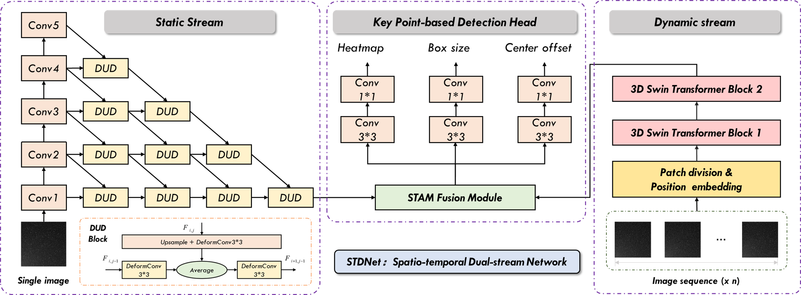
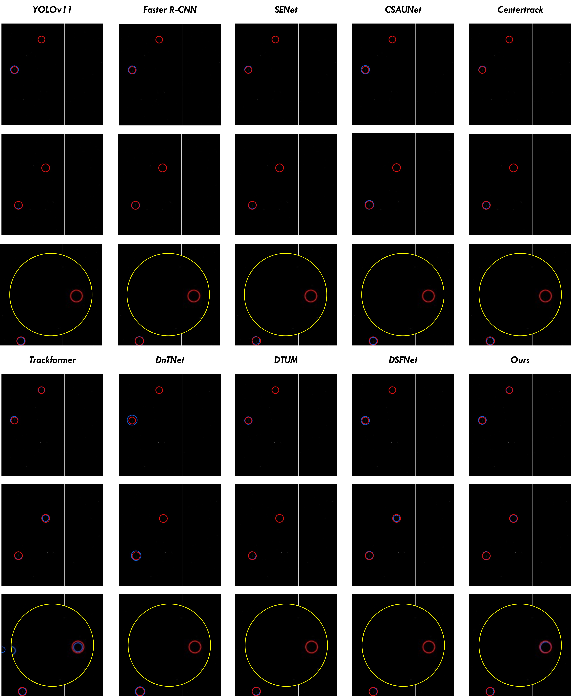
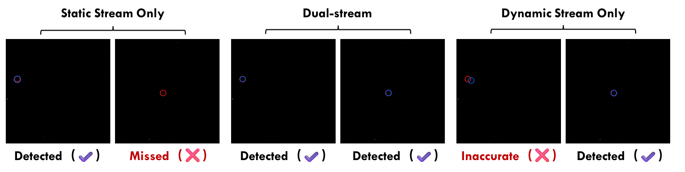
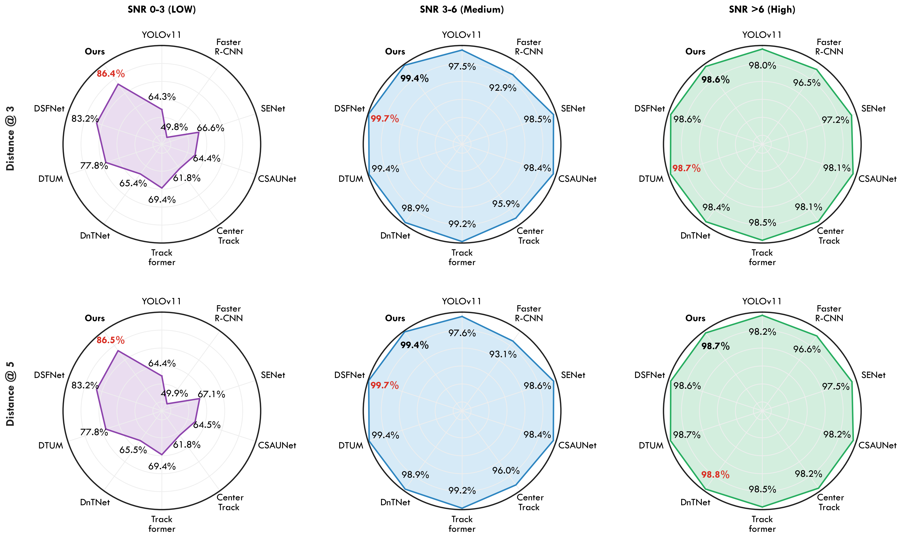

# STDNet

Official implementation of **STDNet: A Spatio-temporal Dual-stream Network for Detecting Faint Space Objects from Ground-Based Optical Imagery**.

We introduce a high-fidelity ground-based optical image simulation method with focal length inversion and full-spectrum image degradation; the simulation toolkit can be obtained [at GitHub](https://github.com/ChaoqunZhung/OpticalSim). Based on the simulated and real observational data, STDNet provides an end-to-end solution for detecting faint, small, and moving space objects under low signal-to-noise ratio conditions.

## Highlights

- A ground-based optical image simulation methodology generates realistic image sequences with precise annotations.
- A Static Stream enhances faint morphological features through hierarchical aggregation and deformable convolution.
- A Dynamic Stream models complex target motion using 3D spatio-temporal window attention.
- A Spatio-temporal Attention Module (STAM) adaptively fuses complementary spatial and temporal cues.
- Experiments on simulated and real-world datasets validate strong robustness and transferability.

## Network Architecture



STDNet accepts a sequence of consecutive optical frames and processes them through two parallel streams. The Static Stream operates on individual frames to preserve fine-grained morphology and strengthen the representation of dim targets. The Dynamic Stream processes volumetric sequence data to capture inter-frame motion and spatio-temporal correlations. The two streams are fused by STAM, and the fused representation is fed into a keypoint-based detection head for center heatmap prediction, box regression, and offset refinement.

## Installation

The experiments in the paper were implemented with PyTorch 1.13 on NVIDIA RTX 3090 GPUs. A typical environment can be prepared as follows:

```bash
conda create -n stdnet python=3.8 -y
conda activate stdnet
pip install torch torchvision --extra-index-url https://download.pytorch.org/whl/cu113
pip install -r requirements.txt
```

Build the NMS extension:

```bash
cd lib/external
python setup.py build_ext --inplace
cd ../..
```

Build DCNv2 if the provided binary is incompatible with your CUDA/PyTorch environment:

```bash
cd lib/models/DCNv2
sh make.sh
cd ../../..
```

## Data

The dataset follows the COCO-style annotation format used by `lib/dataset/coco_bhdata.py`.

```text
data/
  bhdata/
    train.json
    val.json
    test.json
    ...
```

For real-world evaluation, the paper uses BUAA-MSOD, a ground-based wide-field telescope benchmark containing 60 consecutive frames with 2,583 labeled targets across 11,170 cropped sub-images.

## Training

Single-node distributed training:

```bash
CUDA_VISIBLE_DEVICES=0,1 torchrun --nproc_per_node=2 --master_port=36266 train.py \
  --model_name STDNet \
  --gpus 0,1 \
  --lr 1.25e-4 \
  --num_epochs 16 \
  --batch_size 4 \
  --val_intervals 1 \
  --datasetname revise/snr \
  --data_dir /path/to/annotations_0602 \
  --seqLen 5
```

For real-data fine-tuning/evaluation splits, enable:

```bash
--test_real_data True
```

Available model entries in this release are `STDNet`, `STDNet_Static`, and `STDNet_Dynamic`.

## Testing

```bash
python test.py \
  --model_name STDNet \
  --gpus 0 \
  --load_model ./checkpoints/STDNet.pth \
  --datasetname bhdata \
  --data_dir ./data/bhdata/ \
  --seqLen 5
```

## Results

### Real-world Visualization



Qualitative results on the real-world dataset show that STDNet suppresses noise interference in complex observational environments and accurately detects dim targets, including targets near image boundaries. Red denotes ground-truth target locations, while blue indicates predicted positions.

### Real-world Quantitative and Dual-stream Analysis

Metrics are evaluated using centroid distance thresholds of 3 pixels, 5 pixels, and the average over 1 to 10 pixels. The full STDNet corresponds to the dual-stream configuration.



The Static Stream alone is limited by weak or absent morphological cues, while the Dynamic Stream improves motion awareness but may suffer from localization inaccuracies. The dual-stream design effectively combines morphology and motion, yielding a substantial improvement in precision, recall, and F1 score on the real-world dataset.

| Configuration | Precision@3 | Precision@5 | Precision@1:10 | Recall@3 | Recall@5 | Recall@1:10 | F1@3 | F1@5 | F1@1:10 |
| --- | ---: | ---: | ---: | ---: | ---: | ---: | ---: | ---: | ---: |
| Static Stream | 0.672 | 0.672 | 0.672 | 0.690 | 0.693 | 0.692 | 0.681 | 0.682 | 0.682 |
| Dynamic Stream | 0.729 | 0.735 | 0.735 | 0.842 | 0.854 | 0.839 | 0.781 | 0.790 | 0.783 |
| Dual-stream | 0.945 | 0.954 | 0.942 | 0.966 | 0.975 | 0.965 | 0.955 | 0.964 | 0.953 |

### SNR Analysis



Detecting low-SNR targets is the central challenge of ground-based space object detection. STDNet exhibits graceful degradation as SNR decreases and maintains higher recall in the low-SNR interval, where targets are barely distinguishable from background noise. This robustness is attributed to the Static Stream's faint-feature enhancement, the Dynamic Stream's motion verification, and STAM's adaptive fusion of complementary cues.

## References

1. Yuxi Guo, Junzhe Cao, Bindang Xue, *Multiframe spatio-temporal attention motion-adaptive network for moving space target detection*, Advances in Space Research, Vol. 76, No. 9, 2025.
2. [OpticalSim](https://github.com/ChaoqunZhung/OpticalSim)
